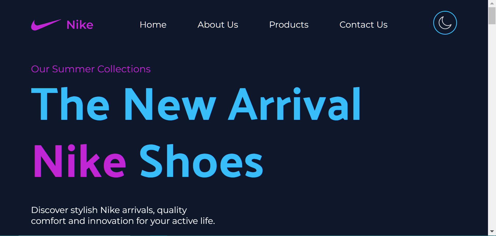
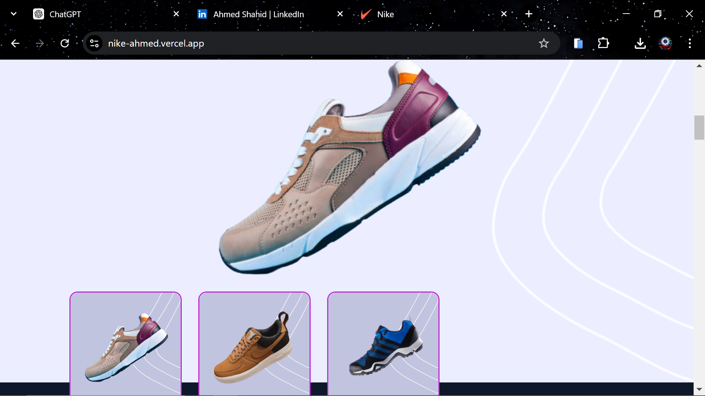
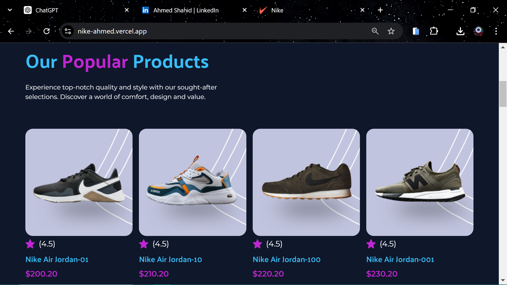
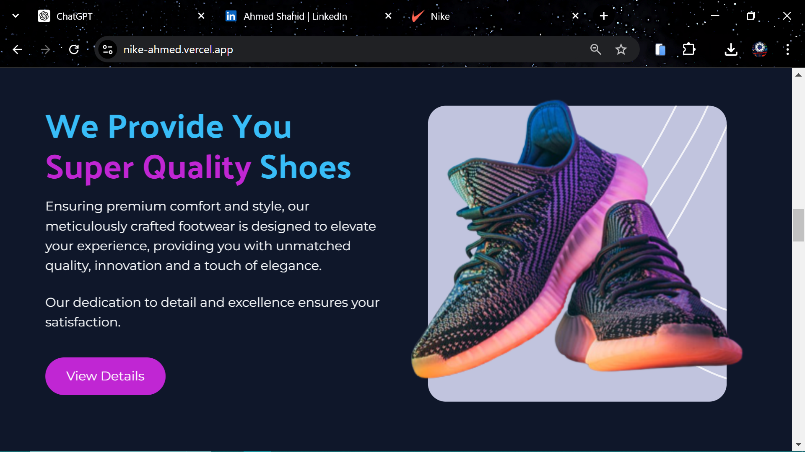
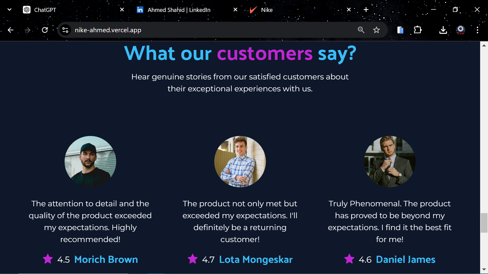

## Screenshots








# Nike Shoes Website

Welcome to the **Nike Shoes Website** repository! This project showcases a sleek, single-page website designed to enhance the digital presence of Nike Shoes. Built with modern web technologies, this site emphasizes a seamless user experience with dynamic features.

## **Project Overview**

This project is a testament to my belief in attention to detail and user experience. It features a responsive design, smooth animations, and interactive text effects, all crafted using cutting-edge web technologies.

## **Features**

- **Consistent Theme:** A visually cohesive design that aligns with brand identity.
- **Dark Mode Support:** A sophisticated dark theme for an enhanced user experience.
- **Fully Responsive:** Optimized for various screen sizes, ensuring a seamless experience across devices.
- **Smooth Animations:** Utilizing the **AOS Library** for engaging visual effects.
- **Dynamic Text Animations:** Powered by **Typed.js** for captivating text effects.

## **Technologies Used**

- **React**: For building the user interface.
- **Tailwind CSS**: For styling and responsive design.
- **AOS Library**: For smooth scroll animations.
- **Typed.js**: For dynamic text animations.

## **Live Website**

Experience the project live here: [ nike-ahmed.vercel.app ](#)

## 💻 **GitHub Repository**

Explore the source code and contribute: [ https://github.com/AhmedShahid786/Nike-Website ](#)

## 📖 **Installation & Usage**

1. **Clone the Repository:**
   ```bash
   git clone https://github.com/AhmedShahid786/Nike-Website.git
   ```
2. **Navigate to the Project Directory:**
   ```bash
   cd Nike-Website
   ```
3. **Install Dependencies:**
   ```bash
   npm install
   ```
4. **Run the Development Server:**
   ```bash
   npm start
   ```

## 📝 **License**

This project is licensed under the MIT License - see the [LICENSE](LICENSE) file for details.

## 📬 **Connect With Me**
<a href="https://www.linkedin.com/in/ahmed-shahid-bb6216301/" target="_blank">
    
</a>
<a href="https://www.youtube.com/@ahmedrazashahid9603" target="_blank">
    
</a>

For any questions or suggestions, feel free to reach out.
